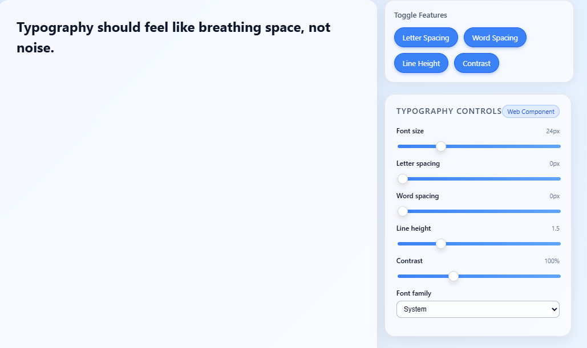

# Typography Controller

A framework-agnostic Web Component that provides a beautiful typography control panel:
font size, letter spacing, word spacing, line height, contrast, and font family.


## Features

- Font Size: Adjust the font size with a slider (range: 12-48px)
- Letter Spacing: Control the spacing between characters
- Word Spacing: Adjust spacing between words
- Line Height: Set the line height (1-3)
- Contrast: Apply a contrast filter (50-200%)
- Font Family: Choose from predefined fonts (Arial, Georgia, Courier New, Verdana)



## Usage

1. Include the `typography-controller.js` script in your HTML file:

```html
<script src="typography-controller.js"></script>
```

2. Add the `<typography-controller>` element to your HTML, specifying the target element via the `target` attribute:

```html
<typography-controller target="#myText"></typography-controller>
<div id="myText">This is the text to style.</div>
```

The controller will automatically apply the selected styles to the target element.

## API

### Methods

- `getValues()`: Returns an object with current values.
- `setValues(values)`: Sets the values from an object.

### Events

- `change`: Fired when any control changes, with `detail` containing the current values.

### JavaScript API Usage

```javascript
const controller = document.querySelector("typography-controller");

controller.addEventListener("change", (e) => {
  console.log("Updated values:", e.detail);
});

controller.setValues({
  fontSize: 30,
  letterSpacing: 2,
  fontFamily: "Georgia"
});
```

## Example

See `index.html` for a complete example.

### Quick note on bundling (Vite/Rollup)

You can start without bundling (just `src/` + `demo/`), then later add:

- `vite.config.js` or `rollup.config.js` to build `src/typography-controller.js` into `dist/typography-controller.js`
- `package.json` with `"module": "dist/typography-controller.js"`

If you want, next step we can wire up a minimal Vite config and `package.json` ready for `npm publish`.

### React usage

```
import { TypographyController } from "./react-wrapper/TypographyController";

export default function App() {
  return (
    <div>
      <h2 id="demoText">Typography should feel like breathing space.</h2>

      <TypographyController
        target="#demoText"
        hide-letter-spacing
        onChange={(e) => console.log(e.detail)}
      />
    </div>
  );
}

```

### Support JS API (setFeatures, setValues) in React

React reference
```
import { useRef, useEffect } from "react";
import { TypographyController } from "./react-wrapper/TypographyController";

export default function App() {
  const ref = useRef();

  useEffect(() => {
    if (ref.current) {
      ref.current.setFeatures({
        letterSpacing: true,
        wordSpacing: false,
        lineHeight: true,
        contrast: true
      });
    }
  }, []);

  return (
    <>
      <h2 id="demoText">Hello world</h2>

      <TypographyController
        ref={ref}
        target="#demoText"
        onChange={(e) => console.log(e.detail)}
      />
    </>
  );
}

```


## License

This project is licensed under the MIT License - see the [LICENSE](LICENSE) file for details.