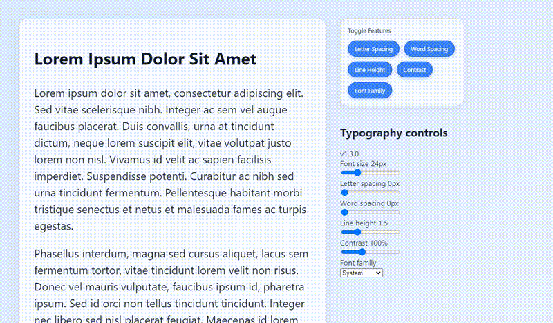

# Typography Controller

A lightweight, framework‑agnostic Web Component that provides a beautiful, interactive typography control panel.
Adjust font size, letter spacing, word spacing, line height, contrast, and font family — all in real time.



## 🚀 Features

- Font Size: Adjust the font size with a slider (range: 12-48px).
- Letter Spacing: Control the spacing between characters.
- Word Spacing: Adjust spacing between words.
- Line Height: Set the line height (1-3).
- Contrast: Apply a contrast filter (50-200%).
- Font Family: Choose from predefined fonts (Arial, Georgia, Courier New, Verdana).
- Framework‑agnostic — Works in HTML, React, Vue, Svelte, etc.
- Public API — getValues(), setValues(), setFeatures(), and change events.
- EAA - This component is designed with full EAA‑aligned accessibility practices, including keyboard navigation, ARIA labeling, and perceivable focus states.

## 📦 Installation

```bash
npm install typography-controller
```

## Usage

1. Import the component

```html
import "typography-controller/dist/typography-controller.js";
```

2. Add the `<typography-controller>` element to your HTML, specifying the target element via the `target` attribute:

```html
<h2 id="myText">This is the text to style.</h2>
<typography-controller target="#myText"></typography-controller>
```

## 🌐 Using via CDN (no bundler)

```
<script type="module" src="https://unpkg.com/typography-controller/dist/typography-controller.js"></script>

<h2 id="demo">Hello World</h2>
<typography-controller target="#demo"></typography-controller>
```

## 📚 JavaScript API

### Methods
| Method | Description | Parameters/Return |
|--------|-------------|-------------------|
| getValues() | Returns the current typography values as an object. | Returns: `{ fontSize: number, letterSpacing: number, wordSpacing: number, lineHeight: number, contrast: number, fontFamily: string }` |
| setValues(values) | Sets the typography values programmatically. | Parameters: `values` (object with keys like `fontSize`, `letterSpacing`, etc.) |
| setFeatures(features) | Enables or disables specific features (e.g., sliders). | Parameters: `features` (object with boolean keys like `letterSpacing: true`) |

### Events
| Event | Description | Detail |
|-------|-------------|--------|
| change | Fired whenever a value changes via the UI or API. | `event.detail`: Object containing updated values (same as `getValues()` return). |


Example

```
const controller = document.querySelector("typography-controller");

controller.addEventListener("change", (e) => {
  console.log("Updated values:", e.detail);
});

controller.setValues({
  fontSize: 30,
  letterSpacing: 2,
  fontFamily: "Georgia"
});
```

## ⚛️ React Usage

Basic usage
```
import "typography-controller/dist/typography-controller.js";

export default function App() {
  return (
    <div>
      <h2 id="demoText">Typography should feel like breathing space.</h2>

      <typography-controller
        target="#demoText"
        hide-letter-spacing
        onChange={(e) => console.log(e.detail)}
      ></typography-controller>
    </div>
  );
}
```

Using JS API (setFeatures, setValues) with refs
```
import { useRef, useEffect } from "react";
import "typography-controller/dist/typography-controller.js";

export default function App() {
  const ref = useRef();

  useEffect(() => {
    if (ref.current) {
      ref.current.setFeatures({
        letterSpacing: true,
        wordSpacing: false,
        lineHeight: true,
        contrast: true
      });
    }
  }, []);

  return (
    <>
      <h2 id="demoText">Hello world</h2>

      <typography-controller
        ref={ref}
        target="#demoText"
        onChange={(e) => console.log(e.detail)}
      ></typography-controller>
    </>
  );
}
```

## License

This project is licensed under the MIT License - see the [LICENSE](LICENSE) file for details.
